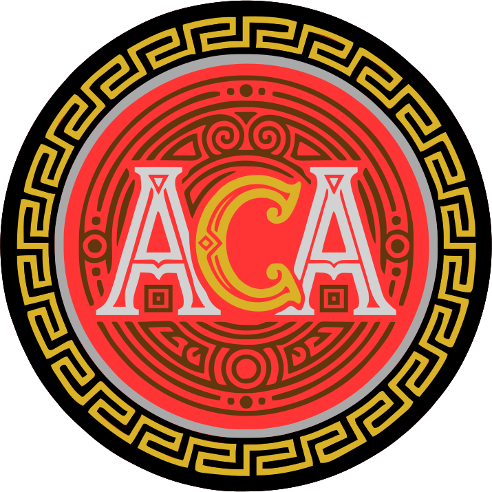

<p align="center">
  
  <br>
  <em>"Aegis CA, gestore certificati"</em>
</p>

# 🔒 Aegis CA - Local Certificate Authority & SSL Manager

Aegis CA è un'applicazione web leggera, sicura e autonoma progettata per la generazione, la firma e la gestione di una **Certificate Authority (CA) locale** e di **certificati SSL self-signed**. 

Sviluppata specificamente per sviluppatori, amministratori di sistema e appassionati di **HomeLab**, Aegis CA ti permette di diventare il "sovrano" della tua infrastruttura crittografica locale, eliminando i fastidiosi avvisi di sicurezza del browser per i servizi interni (come FreshRSS, Pi-hole, Proxmox, ecc.) senza dipendere da entità esterne.

---

## ✨ Funzionalità Principali

### 1. 🛡️ Sicurezza & Autenticazione Multi-Admin
* **Accesso Riservato:** Sistema di login sicuro con hashing delle password nativo di PHP (`password_hash`).
* **Gestione Profilo:** Funzionalità integrata per il cambio rapido della password dall'area riservata.
* **Protezione Sessioni:** Controllo granulare delle sessioni PHP su ogni pagina per bloccare accessi non autorizzati.

### 2. 🏛️ Gestione Certificate Authority (Root CA)
* **Creazione Disaggregata:** Input separati per i campi del Subject (`C`, `ST`, `L`, `O`, `OU`, `CN`) che vengono formattati automaticamente lato backend nel formato standard X.509.
* **Ciclo di Vita:** Tracciamento della data di creazione, della data di scadenza e dello stato (Attiva/Scaduta) con badge visivi.
* **Import/Export:** Download sicuro del certificato (`.crt`) e della chiave privata (`.key`).

### 3. 🚀 Emissione Certificati SSL (Foglia)
* **Firma Dinamica:** Menu a tendina per selezionare quale delle tue CA locali memorizzate deve firmare il nuovo certificato.
* **Supporto SAN (Subject Alternative Names):** Gestione nativa di domini wildcard, sotto-domini e indirizzi IP multipli (es. `*.freshrss.hole`, `192.168.1.50`).
* **Conformità Browser Moderni:** Validità preimpostata a 825 giorni (o personalizzabile) per garantire la massima compatibilità con le policy di Chrome, Safari e Firefox.

---

## 🛠️ Stack Tecnologico

Il progetto è stato sviluppato seguendo la filosofia **No-Framework**, garantendo prestazioni fulminee, zero dipendenze esterne e massima facilità di lettura del codice:

* **Backend:** PHP Nativo (approccio OOP pulito)
* **Crittografia:** Estensione nativa `php_openssl` (Nessuna chiamata di sistema insicura tramite `exec()`)
* **Database:** MySQL / MariaDB (Interfacciato tramite PDO con Prepared Statements contro le SQL Injection)
* **Frontend:** HTML5, CSS3 Moderno (Dashboard in Dark Mode nativa, responsive) e Vanilla JavaScript

---

## 📦 Installazione Rapida

### Requisiti
* Un server web (Apache/Nginx) con **PHP 8.x** o superiore.
* Estensione **`php_openssl`** abilitata nel tuo `php.ini`.
* Un database **MySQL/MariaDB**.

### Configurazione
1. Clona la repository nella cartella del tuo server web:
   ```bash
   git clone [https://github.com/tuo-username/aegis-ca.git](https://github.com/tuo-username/aegis-ca.git)