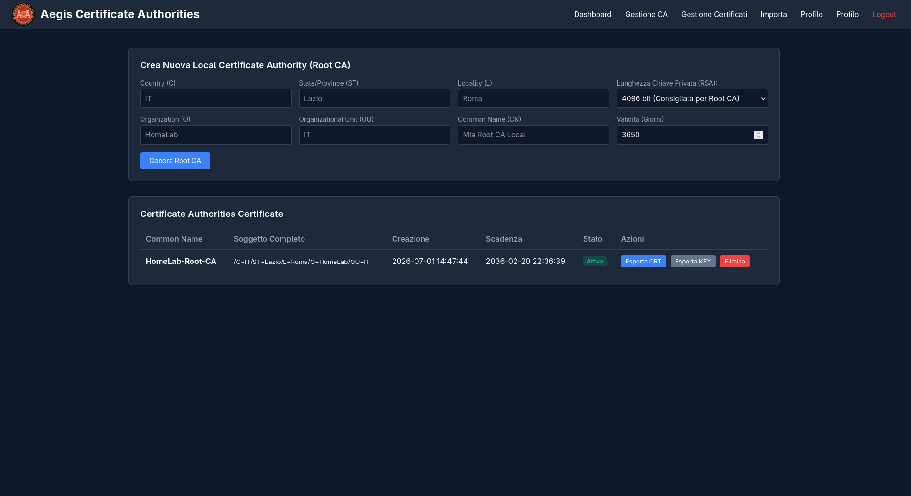
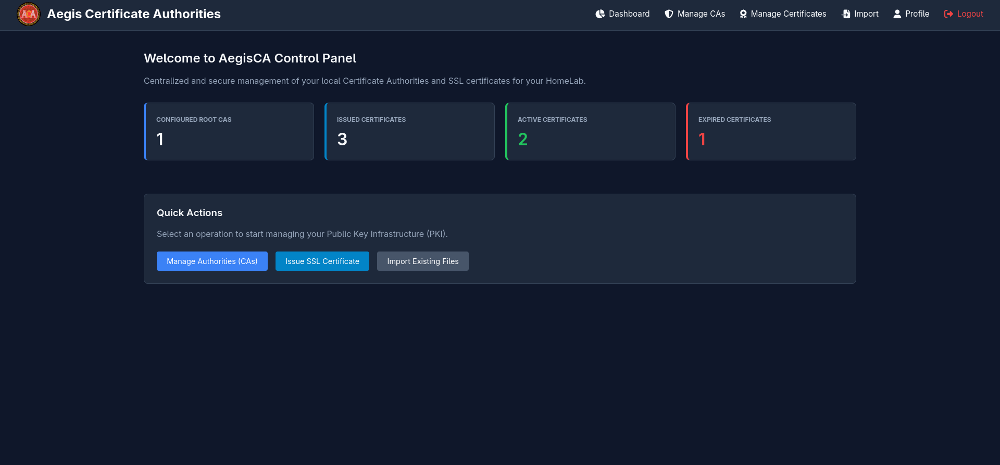

<p align="center">
  <a href="https://github.com/P1c1s/AegisCA">
    
  </a>
  <br>
  <em>"Aegis CA, your local SSL certificate manager."</em>
</p>


# Aegis CA 


**Aegis CA** is a lightweight, secure, and completely self-contained web application for creating, signing, and managing a **Local Certificate Authority (CA)** and its corresponding **self-signed SSL/TLS certificates**.

Designed for **developers**, **system administrators**, and **HomeLab** enthusiasts, Aegis CA allows you to independently manage your own **PKI (Public Key Infrastructure)**. A PKI is a system of policies, processes, and technologies used to create, manage, distribute, store, and revoke digital certificates and public-key encryption. By hosting your own local PKI, you can eliminate browser security warnings for internal services (e.g., FreshRSS, Pi-hole, Proxmox, Home Assistant, and many others) without relying on external public certificate authorities.


### Recommended Setup

> ⚠️ **Note on HTTPS Support:** Aegis CA serves its Web Interface strictly over **HTTP (port 80)** by design. It does not terminate SSL/TLS connection natively. To access the web panel securely via HTTPS (`https://aegis-ca.local`), you must place a **Reverse Proxy** (such as Nginx Proxy Manager, Traefik, or Caddy) in front of the container.

For seamless local traffic routing, we highly recommend pairing Aegis CA with [Nginx Proxy Manager (NPM)](https://github.com/NginxProxyManager/nginx-proxy-manager). NPM makes it incredibly easy to secure your reverse proxies because it **supports custom SSL certificate uploads**. Simply generate your private key (`.key`) and certificate (`.crt`/`.pem`) in Aegis CA, upload them directly to NPM as a "Custom Certificate", and assign them to your local domains in seconds.

---

# 📚 Table of Contents

* [✨ Features](#-features)
* [🛠️ Tech Stack](#-tech-stack)
* [📦 Installation](#-installation)
* [📟 Aegis CA CLI](#-aegis-ca-cli)
* [🛡️ Root CA Installation & Device Trust](#️-root-ca-installation--device-trust)

---

# ✨ Features

### Security and Authentication

* Secure login with password hashing via PHP's `password_hash()`.
* CSRF (Cross-Site Request Forgery) protection on all forms and state-changing requests.
* Password changes directly from the admin area.
* Secure session management with access control on all protected pages.
* Multi-admin support.

<!-- PLACEHOLDER -->

<!--  -->


### Certificate Authority (Root CA) Management

* Guided Root CA creation.
* Separate input fields for Subject (`C`, `ST`, `L`, `O`, `OU`, `CN`) with automatic X.509 standard composition.

* Validity monitoring with creation date, expiration, and status (Active/Expired).
* Import and export of certificates (`.crt`) and private keys (`.key`).


| Attribute | Full Name | Description | Example |
| :--- | :--- | :--- | :--- |
| **`C`** | Country Name | Two-letter ISO country code | `IT`, `US`, `DE` |
| **`ST`** | State or Province | State, region, or province | `Lazio`, `California` |
| **`L`** | Locality Name | City or town | `Rome`, `San Francisco` |
| **`O`** | Organization Name | Company, lab, or organization name | `AegisCA`, `MyHomeLab` |
| **`OU`** | Organizational Unit | Department or sub-division | `IT`, `DevOps`, `Security` |
| **`CN`** | Common Name | Main identity (CA Name, Domain, or IP) | `Aegis Root CA`, `service.local` |




### SSL Certificate Issuance

* Certificate signing using any CA present in the database.
* Full **Subject Alternative Names (SAN)** support.
* Compatibility with:

  * Domains
  * Wildcards (`*.example.local`)
  * Subdomains
  * IPv4 and IPv6 addresses
* Default validity of **825 days**, in line with modern browser recommendations.



---

# 🛠️ Tech Stack

Aegis CA follows a **No Framework** philosophy, prioritizing simplicity, code readability, and performance.

## Backend

* PHP 8 (OOP)
* Native OpenSSL extension (`php_openssl`)
* No use of `exec()` or external OpenSSL calls

## Database

* MySQL
* MariaDB
* PDO with Prepared Statements

## Frontend

* HTML5
* CSS3
* Vanilla JavaScript
* Responsive interface
* Native Dark Mode

---

# 📦 Installation

## Docker
Using **Docker** is the recommended method to install and run Aegis CA.

The containerized approach allows you to:

* avoid manual configuration of PHP and its extensions;
* completely isolate the application;
* simplify updates;
* have a reproducible environment in seconds.

The official image is multi-architecture, supporting both **`linux/amd64`** (x86_64) and **`linux/arm64`** (e.g., Raspberry Pi, Apple Silicon, ARM 64-bit servers), and is available on the GitHub Container Registry:

https://github.com/users/P1c1s/packages/container/package/aegis-ca

#### Download the image

```bash
docker pull ghcr.io/p1c1s/aegis-ca:latest
```

#### Docker CLI

You can pull and run the container directly using the Docker CLI:

```bash 
docker run -d \
  --name aegis-ca \
  --hostname aegis-ca \
  --restart always \
  -e TZ=Europe/Rome \
  -e DB_NAME=aegis_ca \
  -e DB_USER=admin \
  -e DB_PASS='your_secret!' \
  -p 8080:80 \
  -v aegis-ca_data:/data \
  ghcr.io/p1c1s/aegis-ca:latest
```
#### Docker Compose

Download the [docker-compose.yml](https://github.com/P1c1s/AegisCA/blob/main/docker-compose.yml
) file from the repository, or create one locally. Then start the stack using Docker.

```bash
docker compose up -d
```

> **Important:** For security reasons, it is highly recommended to customize the default database credentials (DB_NAME, DB_USER, DB_PASS) before starting the service. Define your custom credentials directly inside the environment section of your docker-compose.yml file.

## First Configuration

Once the container is up and running:

1. Open your web browser and navigate to `http://<your-ip>:8080` (replace `<your-ip>` with your server's IP address).
2. Log in using the default credentials:
* **Username:** `admin`
* **Password:** `admin`


3. **Important:** Make sure to change the default admin password immediately after your first login for security reasons.

---

# 📟 Aegis CA CLI

Aegis CA also includes a **Command Line Interface (CLI)** designed primarily as a **maintenance and recovery tool**. While it allows administrators to manage users, Certificate Authorities, and certificates directly from the terminal, its main purpose is to provide a reliable way to perform administrative and recovery tasks when the web interface is unavailable or insufficient.

The CLI is especially useful for **certificate recovery**, data import and export, application migrations, and resolving issues caused by database corruption or version incompatibilities during upgrades. This makes it possible to quickly restore the PKI infrastructure and recover certificates and private keys without relying solely on the web interface.

The CLI is implemented as a **Python script** and is automatically installed at `/usr/local/bin/aegis-ca`, making it directly executable with:

```bash
aegis-ca
```

To display all available commands:

```bash
aegis-ca --help
```

---

## User Management (`user`)

Provides commands for creating and managing application users.

### Available Commands

- `list` → List all registered users.
- `create` → Create a new administrator.
- `update` → Update a username and/or password.

#### List Users

```bash
aegis-ca user list
```

#### Create a User

```bash
aegis-ca user create \
    -u admin \
    -p secure_password
```

#### Update Username and Password

```bash
aegis-ca user update \
    -u admin \
    --new-username administrator \
    --new-password new_secure_password
```

---

## Certificate Management (`cert`)

Provides commands for managing Certificate Authorities and certificates stored in the database.

### Available Commands

- `list`
- `import`
- `export`

### Options

| Option | Description |
|--------|-------------|
| `-t`, `--type` | Certificate type (`ca` or `cert`). **Required**. |
| `-f`, `--file` | File path or wildcard pattern used for importing certificates. |
| `--cn` | Common Name (CN) to export. Use `all` (or omit the option) to export every matching item. |

#### List All Certificate Authorities

```bash
aegis-ca cert list -t ca
```

#### List All Certificates

```bash
aegis-ca cert list -t cert
```

#### Import a Certificate

If the current directory contains:

- `my-server.crt`
- `my-server.key`

simply specify the base filename:

```bash
aegis-ca cert import \
    -t cert \
    -f my-server
```

#### Bulk Import Using Wildcards

```bash
aegis-ca cert import \
    -t ca \
    -f exported_cas/*
```

The CLI automatically detects matching `.crt` and `.key` pairs, ignoring duplicate or incomplete files.

#### Export All Certificates

```bash
aegis-ca cert export -t cert
```

A directory containing all certificates and their corresponding private keys will be created automatically.

#### Export a Single Certificate Authority

```bash
aegis-ca cert export \
    -t ca \
    --cn "HomeLab-Root-CA"
```

---

# 🛡️ Root CA Installation & Device Trust

To start trusting the SSL/TLS certificates issued by Aegis CA across your devices, you only need to **install and trust your Root CA certificate (`.crt`) once**. 

Installing your Root CA certificate establishes a **Chain of Trust** directly on your system. In traditional setups, every single service (such as Proxmox, Pi-hole, or Home Assistant) requires you to manually import its individual SSL certificate onto every device you use. This quickly becomes a maintenance nightmare, as every renewal or new service forces you to repeat the entire installation process across all your PCs and smartphones.

By installing the Aegis Root CA certificate **just once per device**, your system's trust store accepts it as a trusted authority. From that point on, any SSL certificate signed by your Root CA inherits that trust automatically through the cryptographic chain — eliminating browser security warnings (`NET::ERR_CERT_AUTHORITY_INVALID`) forever. Whether you add 10 new local services or renew expiring certificates years down the line, your devices will seamlessly trust them without any further manual steps.

### Step 1: Export your Root CA

1. Log in to the Aegis CA Web Dashboard.
2. Navigate to **CA Management**.
3. Locate your Root CA and click **Export Certificate** (download the `.crt` file).

---

### Step 2: Installing on devices

#### Windows
1. Double-click the downloaded `.crt` file.
2. Click **Install Certificate...**
3. Select **Local Machine** (requires admin rights) or **Current User**, then click **Next**.
4. Choose **Place all certificates in the following store**.
5. Click **Browse...** and select **Trusted Root Certification Authorities** (Autorità di certificazione radice attendibili).
6. Click **Next** → **Finish**, then confirm the security prompt.

#### macOS
1. Double-click the downloaded `.crt` file to open **Keychain Access**.
2. Drag the certificate into the **System** or **login** keychain.
3. Double-click the newly imported Root CA certificate in Keychain Access.
4. Expand the **Trust** section and set **When using this certificate** to **Always Trust**.
5. Close the window and enter your Mac password to confirm.

#### Linux (Ubuntu / Debian)
1. Copy the `.crt` file to the certificates directory:
   ```bash
   sudo cp my-root-ca.crt /usr/local/share/ca-certificates/my-root-ca.crt
   ```
2. Update the system CA store:
   ```bash
   sudo update-ca-certificates
   ```


#### Android
1. Transfer or download the `.crt` file to your Android device.
2. Open **Settings** → **Security & Privacy** → **More Security Settings** → **Encryption & credentials**.
3. Tap **Install a certificate** → **CA certificate**.
4. A warning may appear; tap **Install anyway**.
5. Select the `.crt` file from your storage and confirm with your PIN/Fingerprint.

> ℹ️ *Note: Menu names may slightly vary depending on your Android manufacturer (Samsung, Xiaomi, Pixel).*

#### iOS / iPadOS
1. AirDrop or download the `.crt` file using Safari.
2. A prompt will say *Profile Downloaded*. Open **Settings** → **Profile Downloaded** (near the top) and tap **Install** in the top right.
3. Follow the prompts and enter your passcode to install the profile.
4. **Crucial Step:** Go to **Settings** → **General** → **About** → **Certificate Trust Settings** (at the very bottom).
5. Under *Enable full trust for root certificates*, toggle the switch **ON** for your Aegis Root CA.

---


